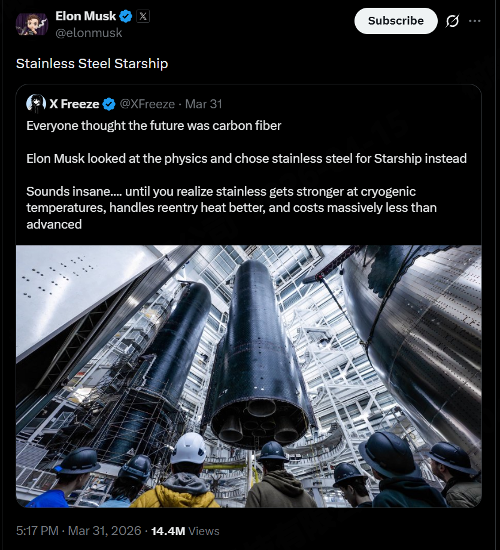

# 工程哲学-1：不锈钢飞船为什么更成功

> **声明**：本文为作者个人观点，不代表任何公司或组织立场。

作者：Eric

2026.04.06

> 这篇文章不提供具体方案结论，而是尝试给出一套判断标准：
> 在复杂系统设计中，我们应该如何做取舍，才能更大概率把事情做成。
>
> SpaceX的starship，是在pvm2.0项目某一天晨会上和大家分享过的一个故事。为了避免说者有意，听着无心。所以整理成文。

很多工程问题，最后卡住的原因，并不是大家能力不够，而是决策一开始就偏了方向。

一个很常见的情况是：团队在做方案选择时，下意识会把“更先进”“更完整”“更优雅”当成更好的答案。但实际项目推进一段时间之后，问题开始集中爆发：进度不可控、复杂度失控、系统难以验证，甚至连问题都很难定位。

这时候通常会有一种反思——是不是实现细节没做好。但多数情况下，问题其实更早就已经埋下了：**我们选了一个在工程上不可持续的路径。**

------

## 从一个大家都知道的例子说起

SpaceX 在做 Starship 的时候，最早其实并没有选择不锈钢，而是走了一条看起来更“正确”的路——碳纤维。

这个选择在当时几乎没有争议。碳纤维的强度重量比、材料性能，在航天领域都是公认的顶级方案。从“技术正确性”角度，它甚至可以说是最优解。

但工程推进之后，问题开始变得具体而现实：制造周期非常长，工艺复杂，废品率高，而且在实际温度环境下表现并不理想。更关键的一点是——整个系统的迭代速度被严重拖慢了。

这件事的转折点，其实不在材料本身，而在目标的变化。

当团队开始意识到，他们真正需要的不是“性能最好的火箭”，而是**“能够快速迭代、不断试飞、不断修正的火箭”**时，答案就变了。

于是他们换成了不锈钢。

这个选择在当时看起来甚至有点“反直觉”。但结果很清晰：制造变简单了，成本降下来了，更重要的是——可以以周为单位快速做原型、测试、爆炸、然后再来一轮。

在当时，Elon Musk 也通过 X（Twitter）直接展示了不锈钢 Starship 的原型，这个时间点正处于材料路线切换阶段：

👉 https://x.com/elonmusk/status/2038908411816153587

> Stainless Steel Starship
> — Elon Musk, X（材料路线切换阶段）

这不是一个事后复盘的结论，而是在工程探索过程中做出的真实选择。

Starship 后面的进展，本质上不是因为材料更先进，而是因为它终于进入了一个**可以持续反馈的工程循环**。

------

## 类似的事情，在软件系统里反复发生

如果把视角从航天换到软件，这种现象其实更加普遍。

比如 Google 早期在做分布式计算时，并没有一开始就设计一套完整复杂的系统，而是先做了 MapReduce 这样一个模型非常简单、但足够解决问题的工具。后面才逐步演进出 Borg，再到今天的 Kubernetes。

整个过程看下来，并不是“先设计好最终形态再一步到位”，而是每一步都在当时的约束下，选择一个**可以跑起来、可以验证、可以继续往前走的方案**。

再比如 SQLite。从数据库理论的角度看，它的设计其实非常“克制”：没有复杂的服务架构，没有分布式能力，甚至很多地方看起来是“简化过的”。但正因为这样，它才能被嵌入到无数系统里，成为一个几乎不需要运维、稳定到可以忽略存在的基础组件。

这些系统的共同点不是“设计最先进”，而是它们都非常清楚一件事：

> **工程系统首先要活下来，然后才谈优化。**

------

这些案例放在一起看，其实指向的是同一个转变：

> **从“设计一个最优系统”，转向“构建一个可以持续演进的系统”。**

------

## 一个更关键的问题：复杂性放在哪里

很多时候，问题并不是“这个方案太复杂”，而是**复杂性出现的位置不对**。

如果复杂性出现在：

- 核心执行路径
- 多个层之间的交界处
- 或者难以验证的地方

那么它的代价会被放大很多倍。因为一旦出问题，你既难以定位，也很难修复，甚至不知道该从哪里下手。

但如果复杂性被限制在某个明确的边界内，比如一个模块、一层抽象，或者一个可以替换的组件里，那情况就完全不同了。它仍然复杂，但至少是**可控的复杂**。

这其实是很多成熟系统的共同特征：
它们不是没有复杂性，而是把复杂性关在了合适的地方。

------

## 工程上真正稀缺的东西

如果把这些案例放在一起看，会发现一个有点反直觉的结论：

工程中最稀缺的资源，并不是算力，也不是技术选型，而是——**稳定的迭代能力**。

也就是：

- 能不能快速做出一个版本
- 能不能很快知道哪里有问题
- 能不能在不破坏整体的情况下修复它

一旦这个能力存在，很多问题其实都会变得“可以解决”。但如果一开始的设计就让系统难以迭代，那么后面几乎所有问题都会被放大。

> 大多数失败的系统，并不是因为方向错误，而是在变复杂之后，团队已经没有能力继续把它维护下去。

------

## 回到日常决策

所以在做技术决策的时候，有几个问题其实比“这个方案是不是更先进”更重要：

- 它能不能在我们当前的团队能力下稳定实现
- 出问题的时候，我们能不能定位并修复
- 它是否支持分阶段上线，而不是一次性完成
- 最重要的一点：它是否会拖慢我们的迭代速度

这些问题往往不会出现在设计文档的第一部分，但它们才真正决定了项目能不能走到最后。

------

## 最后

工程的难点，从来不在于“找到一个完美方案”，而在于：

> **在不完美的约束下，持续做出正确的选择。**

很多看起来“更高级”的方案，并不是错的，它们只是**不适合当前阶段**。而真正好的工程决策，往往都有一个共同特点：看起来不惊艳，但可以走得很远。

再具体一点说，在实际评审中，如果一个方案在以下方面存在明显风险：

- 迭代速度
- 问题可定位性
- 上线路径

那么这些问题的优先级，应该高于它在表达能力或设计完整性上的优势。