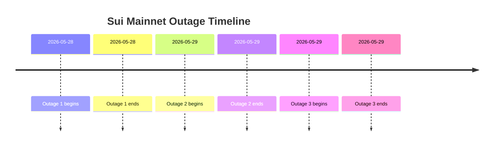
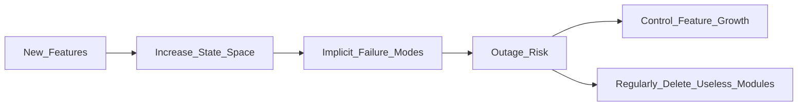

# Engineering Philosophy (VIII)
# The Entropy of Complex Systems
## What Sui's Consecutive Outages Reveal About Complexity

**Author:** Eric
**Date:** June 6, 2026

Sui's three consecutive mainnet outages in May 2026 raise a broader engineering question:

**Why do complex systems become increasingly difficult to control as they evolve?**

This essay explores that question through the lens of software entropy, state-space growth, Normal Accident Theory, and Gall's Law. The goal is not to analyze a particular blockchain failure, but to understand the forces that make all complex systems drift toward disorder over time.

---

## Introduction: Three Mainnet Outages in Less Than 48 Hours

Between May 28 and May 29, 2026, the Sui mainnet experienced three separate outages within less than 48 hours, resulting in more than 15 hours of cumulative downtime. During the outages, approximately $1 billion worth of on-chain asset trading activity was frozen, and the price of SUI declined by roughly 15%.

According to the official postmortem, the first outage was triggered by an edge case introduced in version 1.72, where a newly added Address Balances feature interacted unexpectedly with the gas charging logic. An emergency patch restored the network, but the team acknowledged that the fix carried a known low-probability risk. The following morning, that risk materialized, causing a second outage. Later that day, during a routine epoch transition, another latent bug related to validator randomness persistence was activated, resulting in a third network halt.

At first glance, these appear to be ordinary software bugs.

But viewed from a systems perspective, they reveal something deeper:

**When complexity accumulates beyond a certain threshold, small local failures can evolve into system-wide disruptions.**

Sui is merely the case study.

The real question is:

**Why do complex systems naturally drift toward disorder?**

> **Insight:** The lesson from the Sui incident is not about a specific feature being imperfect, but rather that **continuously adding new features to an already complex system can dramatically expand the state space**, eventually turning "low-probability" problems into real risks.

---

## Software Entropy and State Space

In thermodynamics, entropy is often described as a measure of disorder. Software systems are obviously not thermodynamic systems, but entropy serves as a useful metaphor for understanding the growth of complexity and uncertainty.

The entropy of a software system is determined not by its lines of code, but by the size of its reachable state space.

Suppose a system contains *n* independent modules, and each module can exist in *|S_i|* possible states. The total reachable state space can be approximated as:

$$
|S| \propto \prod_{i=1}^{n} |S_i|
$$

where:

* **|S|** denotes the size of the system's reachable state space.
* **n** is the number of modules.
* **|S_i|** is the number of possible states of module *i*.

The important observation is that state growth is multiplicative rather than additive. Every new feature introduces new states, new interactions, new edge cases, and new failure modes. A feature that appears small in implementation can dramatically expand the number of possible system behaviors.

As a result, complexity grows much faster than functionality.

This is one of the primary mechanisms through which entropy accumulates in software systems.

---

## Why Complex Systems Naturally Accumulate Entropy

Most engineers instinctively blame failures on specific bugs. In reality, bugs are often symptoms rather than root causes. The deeper issue is the accumulation of complexity itself.

### Expanding State Spaces

Every feature increases the number of possible execution paths. Most of these paths are never exercised during testing. Many only emerge under production workloads, real-world timing conditions, or unusual combinations of events.

The Address Balances feature introduced in Sui appeared harmless in isolation. Yet it created a previously unseen interaction with gas accounting logic, exposing an edge case that had remained hidden. As systems grow, hidden states inevitably accumulate.

---

### Increasing Coupling

Early-stage systems are often simple: components are clearly separated, dependencies are limited, and failures are relatively easy to diagnose.

As systems evolve, however, they accumulate more services, more abstractions, more integrations, and more historical compatibility requirements. Eventually, local modifications begin to produce global effects. A fix in one module impacts another. A patch for one failure exposes a different one.

What initially appears to be a software defect is often a consequence of tightly coupled interactions.

---

### Abstraction Leakage

Abstractions help manage complexity, but they do not eliminate it—they merely hide it. As systems evolve, implementation details inevitably leak through abstraction boundaries.

Engineers who once understood a component through a clean interface eventually need to understand the underlying implementation, then the implementation beneath that, and so on. Over time, maintaining the system requires understanding an ever-growing amount of hidden complexity.

The result is a system that becomes increasingly difficult to reason about.

---

## Why Accidents Are Normal

One of the most counterintuitive insights from complex systems theory is this:

**For certain classes of systems, accidents are not exceptional events. They are expected outcomes.**

### Normal Accident Theory

Sociologist Charles Perrow introduced the concept of *Normal Accident Theory*. His central argument was simple:

**In complex, tightly coupled systems, accidents are normal.**

This is not necessarily a consequence of incompetent engineers or careless organizations. Rather, the system eventually grows beyond any individual's ability to fully understand and predict its behavior. Multiple small failures can interact in unforeseen ways, producing outcomes that no single component could cause on its own.

This observation has been applied to nuclear power plants, aviation systems, financial infrastructure, and industrial control systems. Modern blockchain networks increasingly belong in the same category.

Viewed through this lens, Sui's outages were not merely isolated implementation mistakes—they were manifestations of accumulated complexity.

---

### Gall's Law

Another well-known principle comes from John Gall:

> A complex system that works is invariably found to have evolved from a simple system that worked.

The reverse approach rarely succeeds. This principle appears repeatedly throughout software history. Many systems do not fail because they lack functionality. They fail because their complexity grows faster than the organization's ability to manage it.

In the Sui incident, two seemingly minor bugs—one in gas accounting and another related to validator randomness persistence—were triggered in succession, ultimately leading to a cascading failure. This is precisely **emergent failure**: local mechanisms work fine individually, but their interaction produces globally unforeseen failures.

---

## The Largest Source of Entropy Is Often Organizational

Engineers often assume complexity originates in code. In practice, the most dangerous form of entropy often emerges within organizations.

A project may begin with one team, one architecture, and one objective. Several years later it becomes multiple teams, multiple roadmaps, multiple technology stacks, and multiple layers of legacy compatibility.

At that point, organizational complexity and technical complexity begin reinforcing each other. Decision-making slows. Communication costs rise. Technical debt accumulates faster than it can be removed.

Eventually, what appears to be a technical problem is actually an organizational problem expressed through software.

The bottleneck is no longer technology itself—it is the complexity of coordination.

As organizations grow, communication paths, ownership boundaries, and decision-making processes become systems of their own. Managing those systems often becomes harder than managing the software.

---

## Practicing Entropy Reduction

Entropy increase is natural. Entropy reduction is intentional.

The most effective engineering teams are not necessarily the teams that ship the most features. They are the teams that manage complexity most effectively.

### Complexity Budgets

One practical approach is to treat complexity as a budgeted resource. Before introducing a new feature, teams should explicitly evaluate the long-term maintenance burden it creates.

Some engineering organizations explicitly treat complexity as a constrained resource, much like CPU, memory, or operational budget.

The goal is not to prevent innovation, but to ensure that complexity grows at a pace the organization can realistically absorb.

---

### Rollback First

A useful rule of thumb is simple: **if a change cannot be rolled back safely, it is probably too risky to deploy.**

Rollback capability is not just an operational convenience. It is a signal that the system remains understandable and controllable. When rollback becomes difficult or impossible, it often indicates that complexity has exceeded the team's ability to manage it.

---

### Deletion Sprints

Most organizations are skilled at adding functionality. Very few are skilled at removing it.

Regularly deleting obsolete modules, redundant abstractions, and historical baggage is one of the most effective forms of entropy reduction. Growth without removal is simply another path toward complexity accumulation.

Every system accumulates historical baggage. The difference between healthy systems and unhealthy ones is not whether debt exists, but whether it is actively removed.

---

### Simplicity Over Feature Parity

One of the most common justifications for new features is: *"Our competitors already have it."*

This is often the beginning of unnecessary complexity. The better question is: **Does this feature solve a critical problem for our users, and is its long-term value greater than the complexity it introduces?**

Not every capability deserves to exist. Sometimes the most valuable engineering decision is choosing not to build something.

---

## Conclusion

The lessons from Sui's consecutive outages extend far beyond a particular blockchain implementation.

Complex systems naturally drift toward entropy. Every new feature, abstraction, dependency, and compatibility layer expands the system's state space and increases the probability of future failures.

The engineer's role is not merely to create functionality. It is to control complexity—to continuously make trade-offs under imperfect constraints, to know when to add, and more importantly, to know when to stop adding.

In the long run, systems do not compete on feature count.

They compete on their ability to remain understandable, maintainable, and adaptable as they evolve.

A system survives not because it accumulates the most features, but because it accumulates complexity more slowly than its competitors.

**Doing less is not laziness.**

**It is often the highest form of engineering discipline.**

---

### References

1. **Sui Official Blog**: "Sui Mainnet Halts Resolved After Major Upgrade", Sui Foundation (May 2026).
2. **Normal Accidents** (Charles Perrow, 1984): Demonstrates that accidents are unavoidable in high-complexity tightly coupled systems.
3. **Gall's Law** (John Gall, 1975): Clarifies that complex systems must evolve from simple systems.
4. Li Xiaoxiang, "The Entropy Law: The Ultimate Fate and Breakthrough of Software Engineering": Discusses the sources and impacts of entropy in software systems.
5. Academic reports related to blockchain and complex systems, supporting the views of organizational entropy and complexity management.