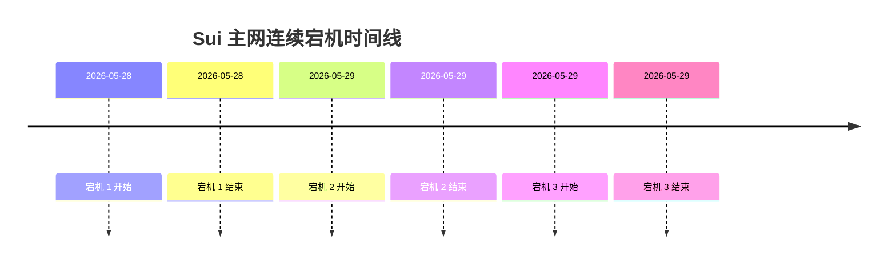
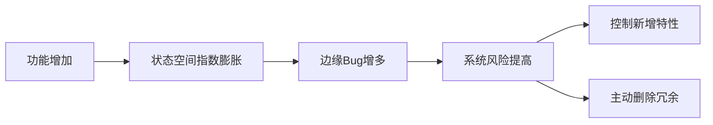
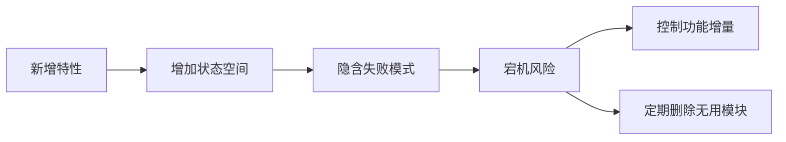

# 工程哲学（八）：复杂系统中的熵增定律 —— 从 Sui 宕机谈复杂度失控

**文章概要：** 本文以 2026 年5月 Sui 主网连续三次宕机事件为引子，阐释高度并行系统中“熵增”（复杂度积累）所带来的风险。我们提出“软件熵”概念，用公式简要形式化状态空间增长，并结合**正常事故理论**和**盖尔定律**等经典思想，分析复杂系统为何自然走向失控。最后给出几条可行的工程实践，帮助团队主动**控制复杂度、做熵减**。全文旨在强调：优秀的系统竞争力，不是功能越多越好，而是能长期维持在可理解、可演进的复杂度水平上。

## Sui 主网连续宕机事件（引子）

2026年5月28日至29日，Sui 主网在不到48小时内连续发生三次停机，累计中断超过15小时。第一次宕机始于5月28日上午7点左右，网络在下午1:30左右恢复；第二次宕机发生在5月29日凌晨5点，8:30恢复；第三次宕机发生在同日下午1:30，至19:20恢复。三次停机期间，链上约10亿美元资产交易活动被冰封，SUI 代币价格也遭遇一轮15%的回调。

官方分析指出：第一次宕机源于v1.72版本引入的“地址余额”功能与**Gas 计费逻辑**交互时触发了一个边缘溢出错误；紧急修复后仍留有已知概率性风险，团队为快速恢复网络暂时承受了该风险。不出意外地，5月29日早上，修复方案暴露了之前未遇见的风险，网络再次瘫痪。第三次宕机则是由于下午例行 **Epoch 切换** 时，一个与验证者保存随机数状态有关的隐性 bug 被激活。表面上看，这是一系列具体技术问题，但深层原因却是：**过多功能累积后，系统复杂度达到了临界，微小边界条件就可能引发灾难性的连锁反应**。

> **洞见：** Sui 事件的教训并不在于某个具体功能不完善，而在于**已经复杂的系统上持续叠加新功能，会使系统状态空间以指数级增长**，最终让“小概率”问题变成现实风险。

## 软件系统中的“熵”与状态空间

在物理学中，熵常被理解为系统无序度。在软件工程中，我们也可以用熵来隐喻**系统的复杂度和不可控性**。一个软件系统的“熵”并不取决于代码行数，而在于系统能够达到的状态数量。假设系统由 $k$ 个功能模块组成，每个模块有 $s_i$ 个可能状态，那么整个系统的可达状态空间（系统熵）近似为：

$$
|S| \propto \prod_{i=1}^{n} |S_i|
$$

这里 $n$ 是系统所有可能状态的组合数量。可以看出，模块数增加时状态总数并不是线性增长，而是以**乘积方式爆炸式增长**。每新增一个功能，都会引入新的状态、边界条件和异常路径，形成大量新的交互模式。这些组合在常规测试中很难全部覆盖，只有在真实运行时才会暴露。正如前文所述：“在软件开发中，熵代表系统中的混乱度和复杂度。随着代码量增长、需求变化、人员更替，系统的熵不可避免地增加”。我们应当将特性增多视为向系统“充能”的行为，每引入一点新功能，都会提升系统的熵和潜在风险。

## 复杂系统天然熵增

为什么复杂系统注定要熵增？主要可以归结为以下几点：

- **状态空间持续膨胀：** 每引入一个新功能，就引入额外的运行状态和交互组合。这些状态很可能在测试环境中未曾覆盖，只有在生产压力下才显现问题。Sui 的案例正说明了这一点：一个原本看似“优雅”的新特性，在极端情况下激活了罕见的错误。

- **耦合度不断上升：** 初期的系统或许只有少量组件，职责分明，问题容易定位。但随着系统演进，组件越来越多，彼此依赖越来越复杂。修改 A 模块可能无意间影响到 B 模块，再修复 B 又引入 C 的隐患。局部改动对全局产生级联效应，排查成本和失败风险成指数级增长。

- **抽象层次泄漏：** 软件开发中不断引入抽象来应对复杂性，但抽象只是一种封装。随着需求变化，这些封装往往会“裂缝暴露”，开发者需要透过多层抽象才能理解核心逻辑，知识负荷不断积累，系统变得越来越难懂。

总体来看，随着系统复杂度提升，每个新增功能都会给整体系统状态空间带来额外几何或指数级的增长。没有人愿意承认系统变得难以掌控，但实际上**没有进行足够的熵减（如重构、简化）的系统，熵只会自发增加**。这就像热力学第二定律描述的：封闭系统的熵总是在增加一样。

## 事故为什么是“正常”的

社会学家查尔斯·佩罗（Charles Perrow）在其著作《正常事故》中指出，对于高度复杂且紧密耦合的系统，事故并不是罕见事件，而是**必然会发生**。多个相互关联的子故障很容易在一起爆发，人为努力也无法将系统完全设计得万无一失。佩罗指出：

> “复杂、紧耦合系统中，多重且意外的故障本质上构成了系统的一部分，事故不可避免”。

也就是说，千万不要把第一次小事故视为偶然。Sui 的例子中，Gas 逻辑和随机数状态两个独立的小 bug，看似不起眼，但在复杂环境下先后被触发，导致系统连环崩溃。这正是**涌现式故障**：局部机制各自正常，但交互后产生了全局不可预见的故障（Emergent Behavior）。这个观点也与 Gall 定律不谋而合——一个能正常工作的复杂系统，必定是从一个简单系统逐步演化而来；而从零开始设计的复杂系统“永远不会真正运作”。Sui 团队显然是在已有的复杂基础上再度叠加新特性，复杂度快速累积，结果导致小概率风险变成现实。

## 组织层面的熵增

值得注意的是，技术复杂度往往伴随着组织复杂度的提升。最初可能只有一个小团队、一个架构、一个目标；几年后却可能分裂出多个团队、多个子产品、多个技术栈、各种历史兼容逻辑。此时真正的“熵”已经超越代码，渗透到了团队文化和运作流程中。例如，多个部门合并后，决策链变长、沟通成本剧增，原本紧耦合的接口成了信息堵塞的源头。技术团队忙于协调和分歧，无法专注于质量提升。归根结底，当组织结构本身高度复杂且存在多重协同时，技术系统极易累积难以梳理的债务。这种**组织熵增**导致管理成本陡升，任何技术风险都可能被放大，故障定位和修复的难度随之激增。

从历史经验看，许多互联网大厂或公链项目最后的瓶颈，不是技术本身，而是组织衰败：创新停滞、流程臃肿、目标分歧。这部分在软件层面也会表现为陈旧模块无法剥离、架构版本兼容混乱、文档标准四分五裂等，使整个生态越来越难以维护。

## 如何主动做熵减

熵增几乎是一种趋势，但**熵减**却需要刻意为之。工程团队真正的竞争力不在于功能扩张有多快，而在于控制复杂度的能力。以下是几条可行的实践建议，帮助团队做“负熵”管理：

- **复杂度预算（Complexity Budget）：** 在每个版本规划阶段，为新增复杂度设定硬性预算。每提出一个新功能，必须同时评估它对未来维护的“复杂性税”。预先限定，比如一个大版本最多只引入两项重量级功能，否则需要高层审批或推迟。让新增的复杂度在团队可控范围内。

- **回滚优先（Rollback First）：** 任何重要升级都必须保证可以快速回滚。如果一个功能上线后难以撤销，就意味着系统可能已过度复杂，团队难以掌控。宁可牺牲一时的进度，也要把回退和稳定放在第一位。只有回滚机制到位，才有勇气迎接变化。

- **删除冲刺（Deletion Sprint）：** 定期安排专门时间和目标做简化工作，把那些不再核心的功能、过时兼容逻辑和冗余抽象砍掉。大多数团队擅长加功能，但很少主动删功能，而删除往往能带来真正的熵减。比如每季度评估一次架构与组件：哪些用不到，就及时移除或隔离；哪些过细的抽象，没有实际益处，就合并回核心流程。

- **休战思考（不做也要预演）：** 在考虑引入新特性时，同时推演一个不做该特性的版本路线，看看核心路径能否在当前系统中顺畅运行。如果答案是“可以接受”的，那就不必急于投入新功能。与其关注“对手都在做”相比，不如基于自身用户需求和技术瓶颈来评估优先级。

- **聚焦主路线（Edge degrade）：** 保证主要功能路径尽可能简单和健壮。对于边缘场景，可以允许降级或延后处理。要明白：**“足够好”的简单方案，往往胜过“面面俱到”的复杂设计**。

总之，工程实践中持续做出正确的取舍并不容易。当系统已经复杂到修复本身都可能引入风险时，我们需要反思：是谁让系统来到这一步？**熵增失控的临界点**不是一夜之间到来的，而是长期复杂度积累的结果。

## 结语

Sui 主网的连续宕机事件再次提醒我们：在已经很复杂的系统上盲目叠加特性，只会带来更加难以掌控的后果。**复杂系统天然倾向于熵增**。每一个新增的功能或抽象都在增加未来故障的几率。工程师真正的工作不只是创造功能，更要控制复杂度。在现实约束下，做出艰难但必要的“少做”选择，往往比盲目增加功能更能保障系统长期稳定。**工程哲学第八篇的核心**：长期看，系统最终比拼的不是功能数，而是谁能把复杂度维持在可理解、可演进的水平。让系统有生命力的，不是堆砌特性，而是有策略地管理和减小熵。就像这次 Sui 宕机所示，**“少做并不是懒惰，而是对系统生命周期的负责”**。

### 主要参考资料

1. **Sui 官方博客**：《Sui Mainnet Halts Resolved After Major Upgrade》，Sui 基金会（2026年5月）。  
2. **Normal Accidents** (Charles Perrow, 1984) 书评，维基百科：论证高复杂度紧耦合系统中事故不可避免。  
3. **Gall’s Law** (John Gall, 1975)，盖尔定律中文介绍：阐明复杂系统必自简单系统演化而来。  
4. 李潇湘，《熵增定律：软件工程的终极宿命与破局之道》：讨论软件系统熵的来源及影响。  
5. **其他**：区块链及复杂系统相关学术报道与中文评论，佐证“组织熵增”与“复杂性难控”观点。  

